<p align="center">
  <a href="LICENSE"></a>
  
  
  
  
</p>

<p align="center">
  
  
  
  
  
</p>

<p align="center">
  
  
  
  
  
</p>

<p align="center">
  <a href="#界面演示">🖼️ 界面实测</a> ·
  <a href="#快速开始">⚡ 快速开始</a> ·
  <a href="#架构概览">🧩 架构概览</a> ·
  <a href="#api-文档">📡 API 文档</a> ·
  <a href="#来源与许可">⚖️ 许可</a>
</p>

# 帧读

**Python 后端的Agent视频内容分析与证据工作台。** 导入视频，选择目标，整理可核对的结论；点击报告中的时间引用，回到原片。

帧读使用 Python API、独立任务 worker 和 Vue 工作台，将语音转写、关键帧 OCR、分块检索与 Planner / Executor / Critic 循环组织成一个可追踪的分析流程。适合课程笔记、会议内容整理、带字幕的讲解和内容审查。

## 界面演示

### 📚 素材库

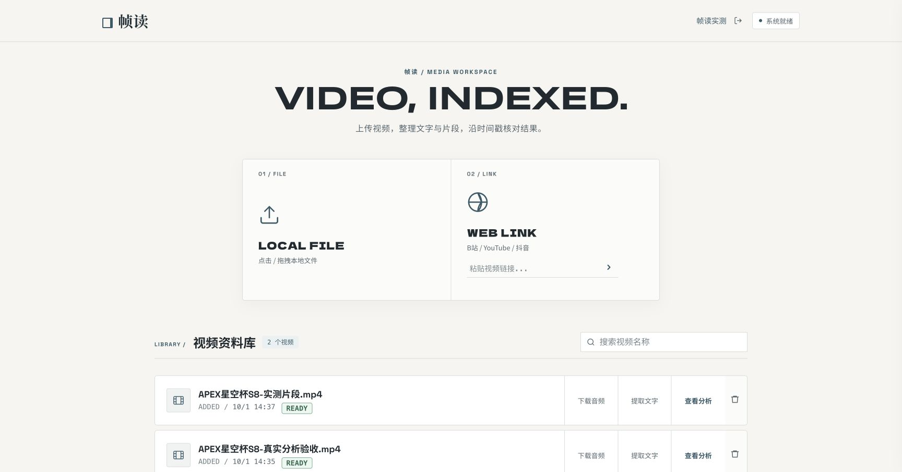

### 🎬 视频工作台

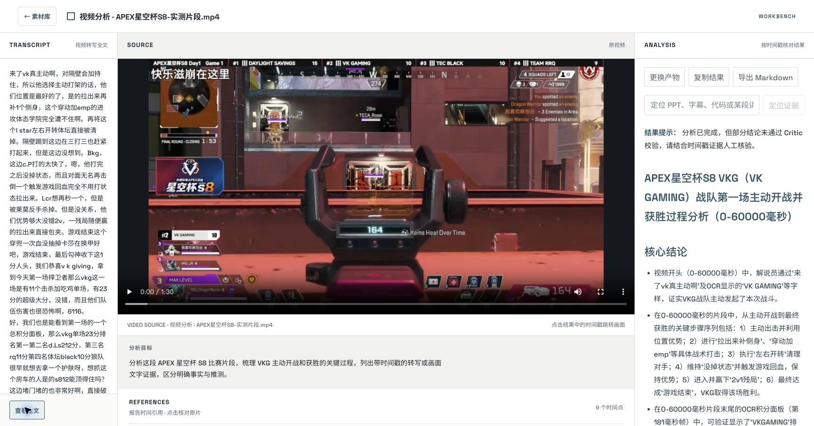

<details>
<summary>🔐 登录与注册</summary>

| 🔑 登录 | 👤 注册 |
| --- | --- |
| 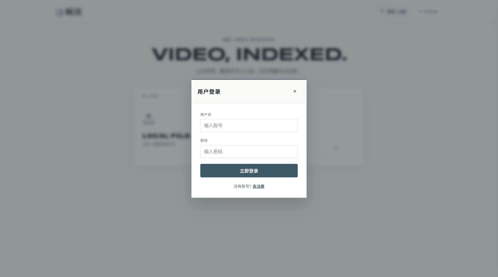 | 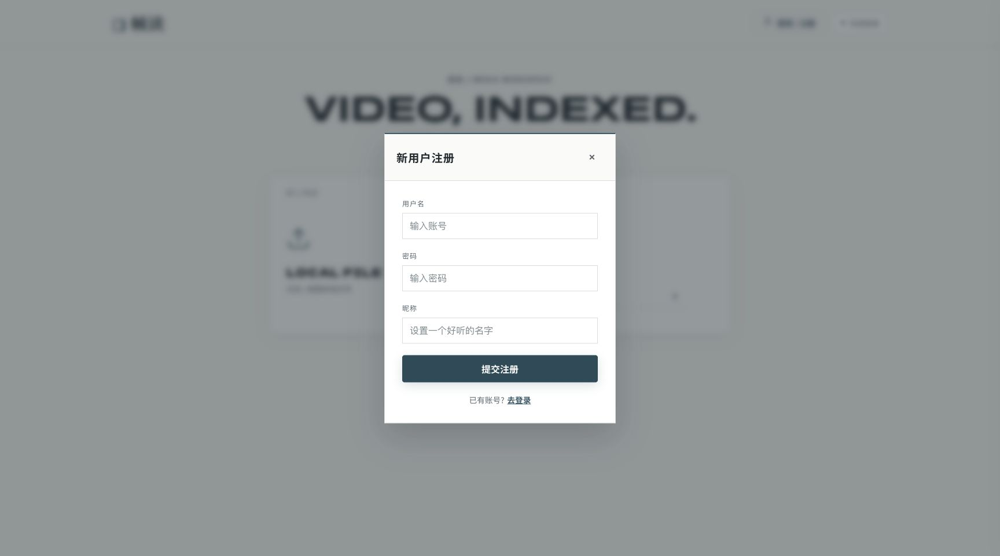 |

</details>

<details>
<summary>📤 上传与分析流程</summary>

### 📤 视频上传

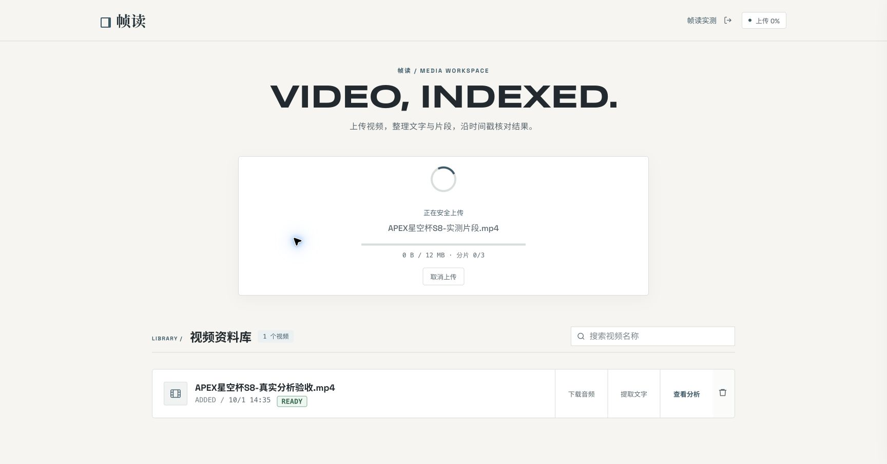

### 🎯 模式与目标

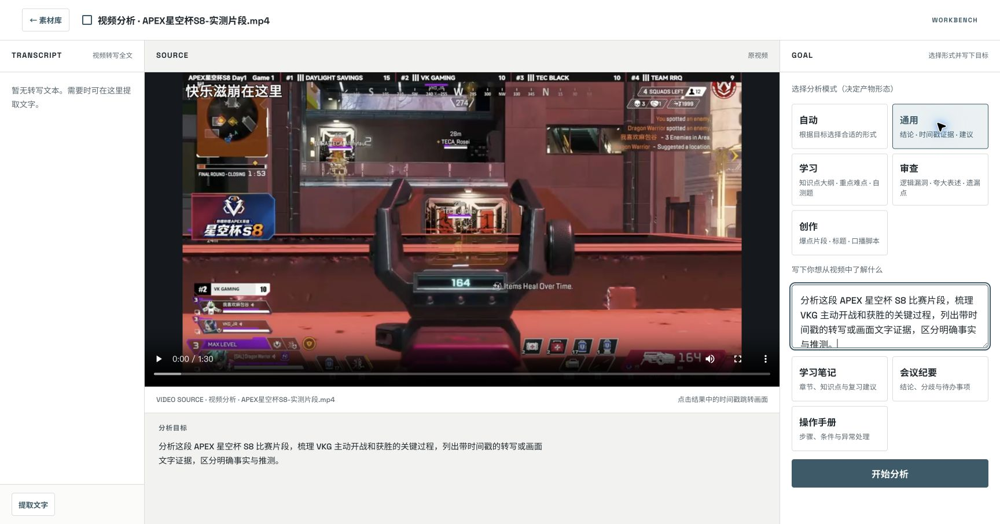

### ⏳ 后台分析


</details>

<details>
<summary>🔎 证据、转写与执行详情</summary>

### 🔎 证据检索

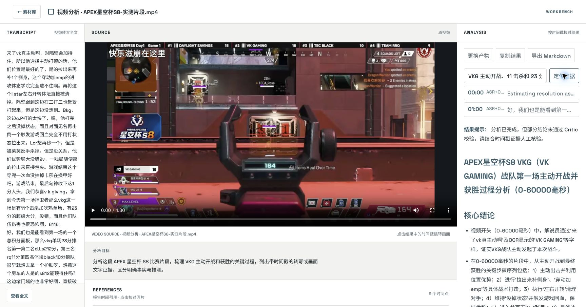

### ⏱️ 原片定位

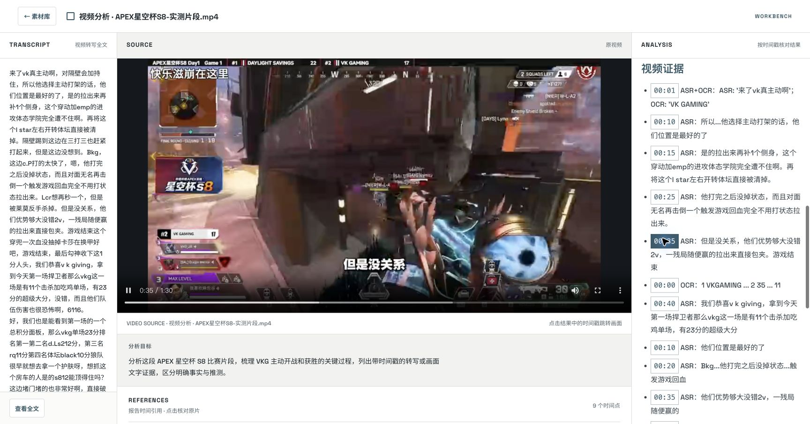

### 📄 转写全文

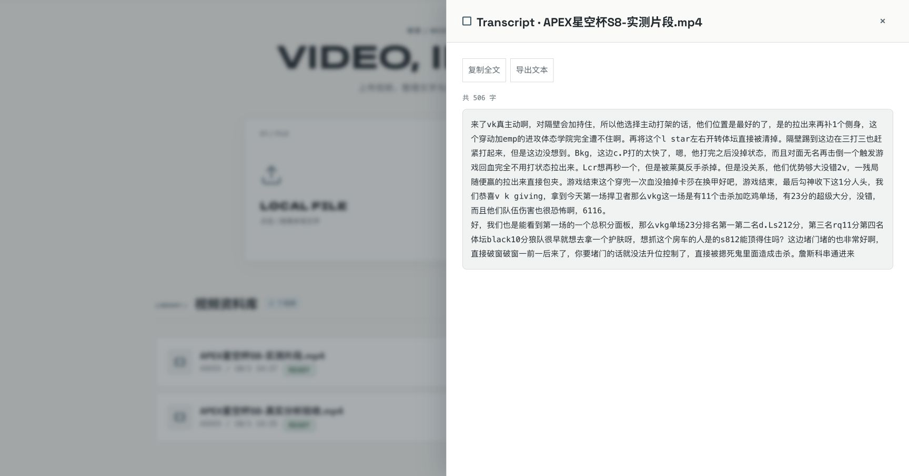

### 🧭 执行详情

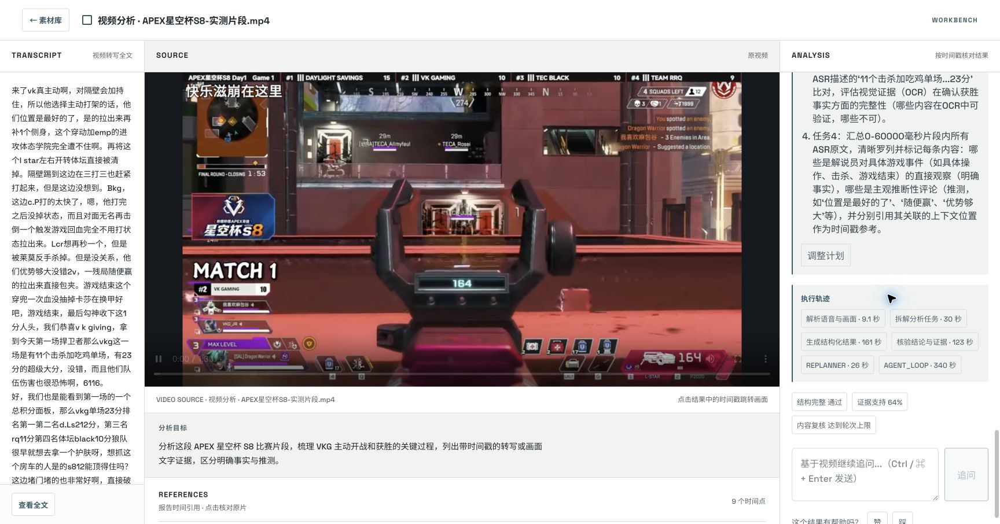

</details>

<details>
<summary>💬 计划、追问与产物</summary>

### 📝 调整计划

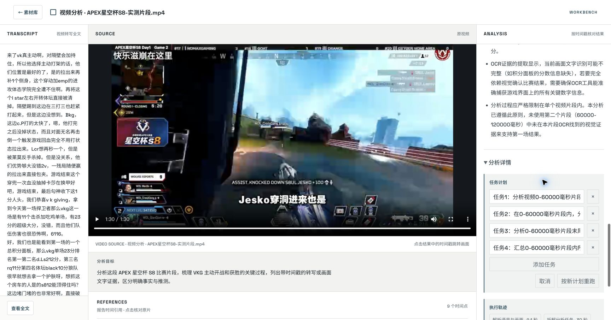

### 💬 视频追问

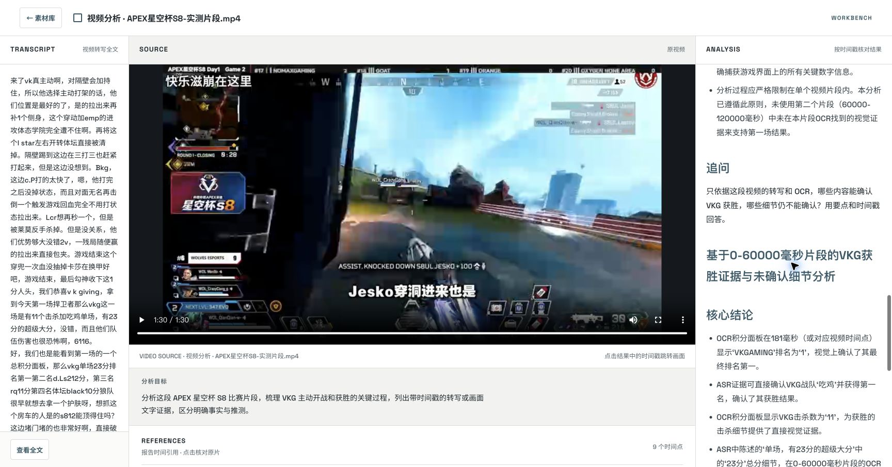

### 👍 结果反馈

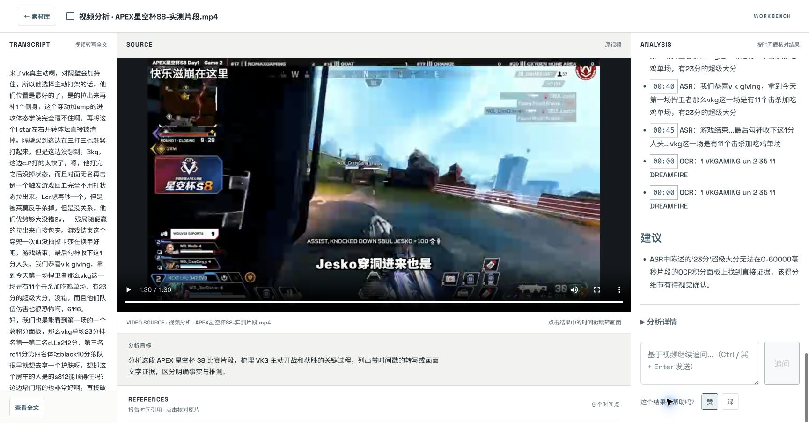

### 🎛️ 产物选择

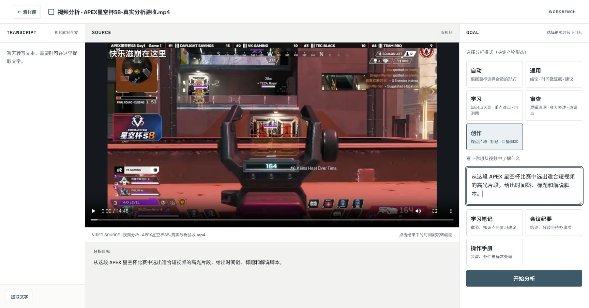

</details>

<details>
<summary>📡 API 界面</summary>

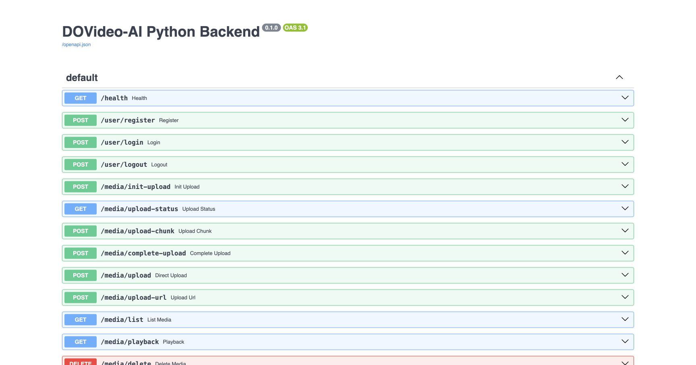

</details>

## 功能

- 🎯 **目标驱动的分析**：通用、学习、审查、创作四种产物模式；自动选项将目标路由到具体模式。
- 🎙️ **语音与屏幕文字融合**：ASR 和 OCR 两个分支并行构建 VideoContext，按时间窗口合并证据。
- 🔎 **长视频检索**：五分钟分块，结合向量、关键词与时间线索筛选上下文；外部检索失败时有本地降级路径。
- 🧠 **有限 Agent 循环**：Planner 拆解任务、Executor 生成产物、Critic 校验；受轮次、时间、Token 和可配置费用预算限制。
- ♻️ **可恢复的任务处理**：API 与 worker 分离，RocketMQ 投递、租约适配、内容锁、阶段检查点和失败台账共同约束重复执行。
- ⏱️ **可核对的阅读体验**：原片、转写、报告同屏；底部时间引用直接来自当前报告，不额外调用模型。
- 🖥️ **完整交互入口**：分片上传与断点续传、链接导入、证据检索、追问、计划调整、反馈、音频和 Markdown 导出。
- 📊 **运行可观测性**：SSE 展示阶段状态；trace 区分阶段耗时、请求次数、实际 usage 与估算成本。

## 快速开始

### 🖥️ A. 只看界面

需要 Node.js 22.12+，无需后端或模型密钥：

```bash
git clone https://github.com/Wanming08/framed-read-code.git
cd framed-read-code/frontend
npm ci
npm run dev -- --host 127.0.0.1
```

打开终端显示的地址，并加上 `/?demo`，通常是 <http://127.0.0.1:5173/?demo>。默认进入工作台，点击「素材库」可查看首页。

### 🚀 B. 运行完整项目

需要 Docker Compose；在仓库根目录运行：

```bash
git clone https://github.com/Wanming08/framed-read-code.git
cd framed-read-code
```

```bash
./scripts/dev-up.sh
curl --fail http://127.0.0.1:9090/health
```

脚本首次生成私有 `.env` 和基础设施密码，构建镜像、启动服务、执行数据库迁移并初始化 RocketMQ。没有模型密钥时，可先注册、登录、上传和播放视频。

在生成的 `.env` 中填写 `SILICONFLOW_API_KEY`，再次运行启动脚本即可开启分析 worker。默认组合为 DeepSeek-V3.2、TeleSpeechASR 和 bge-m3，分别承担文本生成、语音识别与向量生成。供应商替换需要核对接口和响应格式兼容。

另开终端运行前端：

```bash
cd frontend
npm ci
npm run dev -- --host 127.0.0.1
```

| 入口 | 默认地址 |
| --- | --- |
| 前端 | `http://127.0.0.1:5173`，端口占用时以终端输出为准 |
| API 健康检查 | `http://127.0.0.1:9090/health` |
| Swagger 文档 | `http://127.0.0.1:9090/docs` |
| OpenAPI | `http://127.0.0.1:9090/openapi.json` |

## 架构概览

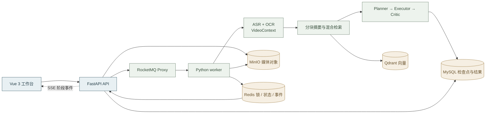

<details>
<summary>🧠 Agent · Critic</summary>

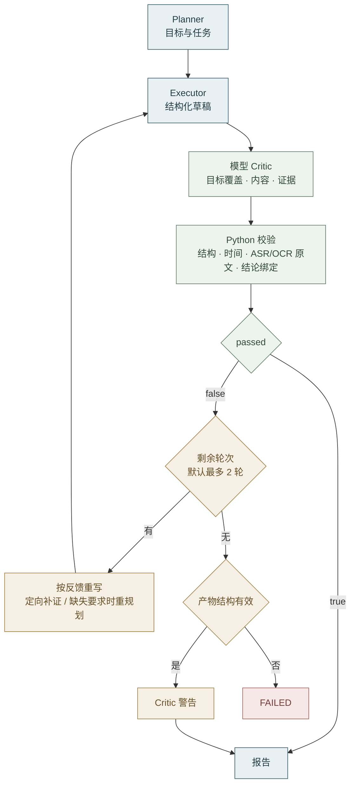

</details>

<details>
<summary>📨 异步分析 · 消息与事件</summary>

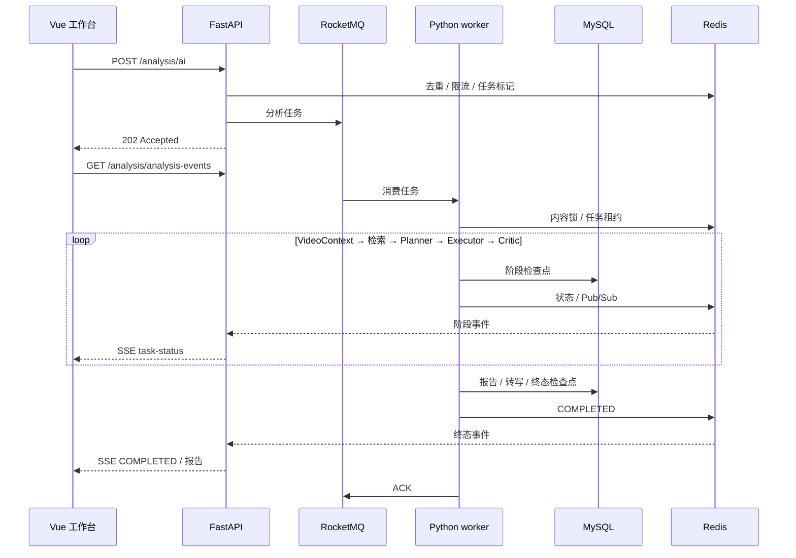

</details>

## API 文档

当前提供 **31 个业务方法与路径**，按 HTTP 方法 + 路径计数，不含自动文档端点和 OPTIONS。认证使用 Bearer 会话令牌；普通 JSON 使用 `{code,message,data}` 信封，SSE 和文件响应采用各自格式。

| 能力 | 代表接口 |
| --- | --- |
| 账号 | `POST /user/register`、`POST /user/login` |
| 上传 / 素材 | `POST /media/init-upload`、`POST /media/upload-chunk`、`GET /media/list` |
| 原片播放 | `GET /media/playback` |
| 分析与状态 | `POST /analysis/ai`、`GET /analysis/analysis-status` |
| 实时事件 | `GET /analysis/analysis-events` |
| 计划 / 轨迹 | `GET /analysis/agent-plan`、`GET /analysis/agent-trace` |
| 证据 / 追问 | `GET /analysis/evidence-search`、`POST /analysis/follow-up` |
| 转写 / 导出 | `POST /analysis/transcribe`、`GET /analysis/download` |
| 管理 | `GET /admin/failed-analysis` |

## 能力边界

- ASR 当前以约 60 秒为片段粒度；左侧全文是纯文本，不提供逐句字幕对齐。
- 摘要、ASR 分片与 OCR 帧循环目前各自串行；ASR / OCR 两个整体分支并行。长视频耗时不能直接从视频时长推算。
- 检查点复用已经完成并保存的阶段，不能恢复一半的供应商 HTTP 请求；部分阶段还不是逐片保存。
- Critic 未通过时可能返回带警告的报告，时间引用仍应结合原片核对。
- trace 的费用需要配置模型单价；未返回 usage 的请求不能保证被完整计量，统计不替代供应商账单。
- 当前 Compose 面向本地开发，未提供生产高可用或公网部署 SLA。Jev、动态视觉路由和直接视频视觉模型还未接入。

## 目录

```text
frontend/             Vue 工作台
  src/                页面、上传、SSE 与播放器
backend/              Python 3.12 后端
  app/api/            HTTP 接口与认证
  app/agent/          Planner / Executor / Critic
  app/services/       媒体、检索、检查点与任务
  app/integrations/   模型与基础设施适配
  app/workers/        消息消费与租约
  migrations/         Alembic 与基线 SQL
scripts/              启动与 RocketMQ 初始化
docker/               MinIO 镜像构建
rocketmq/             Broker 配置
docker-compose.yml    本地服务编排
.env.example          配置模板
LICENSE               MIT 许可证
```

## 来源与许可

帧读由 [Wanming08](https://github.com/Wanming08) 开发维护，采用 [MIT License](LICENSE)。Python 后端、任务 worker、运行适配及前端界面与交互改造为本项目的开发成果，新增和改编贡献署名 `Wanming08`。

业务迁移以 [Xiaoc7r/DOVideo-AI 的固定版本](https://github.com/Xiaoc7r/DOVideo-AI/tree/df23f36226495f9cd4e7f740ea8a3b8cac51fbf2) 为参考。沿用或改编的上游前端代码、提示词与数据库 SQL 保留原 MIT 许可及 `Copyright (c) 2026 Majst`；本项目贡献补充 `Copyright (c) 2026 Wanming08`。
